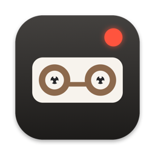

# WorkTape

WorkTape records your screen while you work, then uses Claude to tell you which workflows take your time and which of them Claude could take over. Everything stays on your Mac. The only data that leaves it is what the daily report sends to Claude through your own Claude Code login: sampled screenshots, and the prompts you typed in the Claude sessions it links to.

## What you get

- **Recording that needs no attention.** A menu-bar app takes a frame every 2 seconds, but only while one of the apps you chose is in front. It pauses after 5 minutes without input and whenever the screen is locked. Each hour becomes one small video, about 10–40 MB per hour of work, and recordings older than 30 days are deleted.
- **A daily report (07:00).** Your day is grouped into named workflows, such as "Rebuild a client chart from source data" or "Triage Slack and email". Each shows your hands-on time versus time spent waiting or watching, and has a ▶ Watch button that opens the video at that moment. When you were in Claude or Claude Code, the report also links the session transcript.
- **Weekly (Monday 08:00) and monthly (the 1st) reviews.** Workflows are ranked by how much time Claude could save you each week. Each gets a score and the likely bottleneck: how you work, the prompt, "Claude already does it, you just haven't handed it off", or a missing tool. Prompt problems come with a suggested rewrite, based on Anthropic's prompting guides.
- **Stupidity tax.** Minutes spent passively scrolling X, LinkedIn, YouTube, Reddit and similar sites. Time spent writing posts, comments or messages, and viewing LinkedIn profiles, isn't counted.

The WorkTape window opens at login. It's also under the menu-bar icon (● recording, ○ idle, ⏸ paused).

## Install

You need macOS 14 or newer, plus:

1. **Xcode Command Line Tools:** `xcode-select --install`
2. **ffmpeg:** install [Homebrew](https://brew.sh), then `brew install ffmpeg`
3. **Claude Code, signed in** (needed for the reports; recording works without it): `curl -fsSL https://claude.ai/install.sh | bash`, then run `claude` once.

Then download and install it (from Terminal):

```bash
git clone https://github.com/nils-cmyk/worktape.git ~/worktape
cd ~/worktape && bash install.sh
```

To update later: `cd ~/worktape && git pull && bash install.sh`. This keeps your recordings and settings.

The installer builds the app on your Mac, asks for your first name, a one-line description of your work and (optionally) your clients, and starts recording. Then:

1. macOS asks for **Screen Recording** permission. Allow WorkTape in System Settings → Privacy & Security → Screen Recording, then restart it with the command the installer prints.
2. If you limit recording to certain browser profiles (see below), macOS also asks for **Accessibility** permission. WorkTape uses it to read the profile name on the browser's toolbar.

## Choose what gets recorded

Edit `~/WorkTape/config.json`. By default it records Claude, terminals running Claude Code, and every window of Chrome, Brave, Arc, Edge and Safari. For example, to record only the "Work" profile in Chrome:

```json
"browsers": { "com.google.Chrome": ["Work"] }
```

`["*"]` means every window of that browser. Named profiles work in Chromium browsers (Chrome, Brave, Edge, Arc). To record another app, add its bundle ID to `"apps"`; you can look one up with `osascript -e 'id of app "Slack"'`. Changes take effect after you restart the app from its menu-bar icon.

`~/WorkTape/classify.json` holds your name, your one-liner, your clients, and the list of sites that count as a waste of time. `~/WorkTape/watch.json` lists the tools Claude can use on your Mac, which the reviews take into account when scoring.

## Files

| Path | What it holds |
|---|---|
| `~/WorkTape/videos/<day>/<HH>.mp4` + `.tsv` | hourly video, plus per-frame app, window title and input counts |
| `~/WorkTape/reports/` | daily, weekly and monthly reports (what the app window shows) |
| `~/WorkTape/data/segments.csv` | one row per work segment, across all days |
| `~/WorkTape/data/sessions.csv` | segments linked to Claude Code transcripts |
| `~/WorkTape/data/waste.csv` | stupidity tax per site per day |
| `~/WorkTape/logs/` | logs of the scheduled jobs |

To run a report now, e.g. for yesterday: `python3 ~/WorkTape/bin/classify.py`. To run the weekly review now: `python3 ~/WorkTape/bin/watcher.py weekly`.

## Uninstall

```bash
bash uninstall.sh                      # removes the app and its scheduled jobs, keeps ~/WorkTape
bash uninstall.sh --delete-recordings  # also moves ~/WorkTape to the Trash
```

## Notes

- Keystrokes and clicks are counted, never logged: the app reads the counters macOS already keeps, not the keys themselves.
- If you have an Apple Development certificate, the installer signs the app with it, so macOS permissions survive reinstalls. Without one, macOS may ask for Screen Recording again after each reinstall.
- The reports use your Claude plan: about one Claude call per 15 minutes of recorded time on a busy day (so around 30 for 8 hours), fewer when the screen is mostly still. A weekly or monthly review is one more call.

## License

MIT. See [LICENSE](LICENSE).
